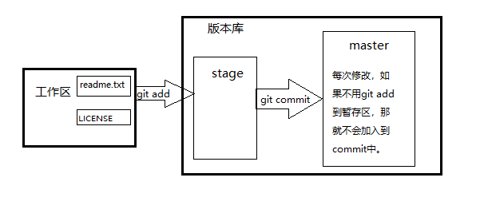

`😀看了廖老师的git教程感觉很不错,写了一个简单的git流程帮助理解记忆`

#### Git 流程

##### 创建本地仓库

```js
$ mkdir learn//make directory[目录]创建版本库 
$ cd learn//change directory切换版本库目录 
$ git init//initialize[初始化]把这个目录变成Git可以管理的仓库
→Initialized empty Git repository[仓库] in /Users/michael/learn/.git/
//创建一个readme.txt文件,编辑内容后保存
$ git add readme.txt//把文件修改添加到暂存区  
$ git commit -m "wrote a readme file"//把暂存区的所有内容提交到当前分支
//好的,我们现在完成了第一步操作咯!
```



```js
//这三个命令是查看状态与之前区别的
$ git status//让我们时刻掌握仓库当前的状态
$ git diff readme.txt//查看readme.txt具体修改了什么内容
$ cat readme.txt//查看readme.txt内容 

//下面三个命令是查看提交历史和命令历史的
$ git log//查看提交历史
$ git reflog//查看命令历史    
$ git log -- pretty=oneline //加上参数可以让输出更清晰
$ git log --graph --pretty=oneline --abbrev-commit//----graph是graphic的缩写[图形显示] abbreviate-commit[缩写的commit-id](这个就是加强版的清晰了)
```


##### 远程仓库构建

```c
//配置身份
$ git config --global user.name "yourname"
$ git config --global user.email "your@email.com"
//这里的yourname与github的用户名一致,your@email.com与github登录邮箱一致

$ ssh-keygen -t rsa -C "Comment" //创建SSH Key
//本地Git仓库和GitHub仓库之间的传输是通过SSH加密的,所以我们需要新建一个SSH Key
//----SSH(Secure Shell)专为远程登陆会话和其他网络服务提供安全性的协议
//----(keygen是keyGenerator注册机的缩写  -t选择密钥类型type  -C识别这个密钥的注释Comment) 
//----rsa和dsa是两种加密算法。dsa是加/解速度快,密钥量短的对称加密；rsa算法复杂,加/解速度慢,非对称加密。

$ cd ~/.ssh//进入.ssh目录
//~ 表示当前用户的 home 目录,展开即为 /home/用户名
//cd ..则表示目前目录位置的上一层目录,如果感兴趣可以自行搜索更多命令 
$ ls//(ls是List directory contents缩写,列出目录内容)  
→(id_rsa.pub id_rsa ..)
$ cat id_rsa.pub// 将文件内容打印显示(print and concatenate[连锁]files)
//最后将这段协议口令在GitHub里设置(自行搜索如何设置)
```

```js
//添加远程库(添加之前你得在GitHub上自行创建一个库)
$ git remote add origin git@github.com:mengbaodouchi/learn.git//还有https协议的,但这个更快更安全
//remote[远程] 远程库的名字就是origin,这是Git默认的叫法,也可以改成别的git
$ git remote -v  //查看当前远程仓库名(-v是version)
$ git remote rm origin//删除当前远程仓库名 (如果你觉得这名不好听的话)
$ git push -u origin master //----用git push命令,实际上是把当前分支master推送到远程。第一次推送master分支时,加上了-u参数,Git不但会把本地的master分支内容推送的远程新的master分支,还会把本地的master分支和远程的master分支关联起来,在以后的推送或者拉取时就可以简化命令。

/ /我曾经在推送时遇到过链接超时的问题:connect to host github.com port22:Connection timed out/
//首先找到git的安装目录,找到/etc/ssh/ssh_config文件,用notepad++打开这个文件,并把下面一段话复制到最后一行并保存,最后使用git push -u origin master验证结果
```

```c
Host github.com
User git
Hostname ssh.github.com
PreferredAuthentications publickey
IdentityFile ~/.ssh/id_rsa
Port 443
```


```c
//clone远程仓库(GitHub)在你的根目录下克隆
$ git clone https://github.com/mengbaodouchi/learn.git
$ git clone git@github.com:mengbaodouchi/learn.git
//两个协议都写了,至于你最终选择什么随你自己啦!
```


##### 时光穿梭

```js
//撤销修改
$ git restore -- readme.txt   //作用于还未放到暂存区(尚未add)
$ git reset HEAD readme.txt   //作用于还未提交到分支(尚未commit)
//版本回退
$ git reset --hard HEAD^    //回退到上一个版本
$ git reset --hard HEAD^^   //回退到上上一个版本
$ git reset --hard HEAD~100 //回退到上100个版本
$ git reset --hard 1094a//回退到未来某个版本(对的,就是之前我们用git log得到的commit-id编号)
//删除文件
$ git rm readme.txt       	   //从版本库中删除该文件(如果只用 rm readme.txt那就随时可以恢复提交过的文件）
$ git commit -m "remove test.txt"//提交本次修改
//命令git rm用于删除一个文件。如果一个文件已经被提交到版本库,那么你永远不用担心误删,但是只能恢复文件到最新版本,你会丢失最近一次提交后你修改的内容。
```

##### 分支管理

```js
//分支是Git最核心的部分
$ git switch -c dev//创建并切换,相当于以下两条命令
$ git branch dev//创建
$ git switch dev//切换    
$ git branch//查看当前分支
$ git branch -d dev//删除dev分支  
$ git branch -D dev//强势删除未保存的dev分支     
    
$ git merge dev//合并分支(合并分支往往并不顺利,需要我们手动解决冲突载提交保存)
$ git merge --no-ff -m "merge with no-ff" dev  //----禁用Fast forward,合并dev分支.本次合并要创建一个新的commit,所以加上-m参数,把commit描述写进去  

//现在体会一下(git log --graph --pretty=oneline --abbrev-commit) 的用处吧!   
  
```

##### 标签管理

```js
//标签很方便
$ git tag v1.0//打上标签(切换到需要打标签的分支git switch master)
$ git tag v0.9 f52c6//打上标签(直接给某次提交打上标签)
$ git tag -a v0.1 -m "version 0.1 released" 1094adb//(-a指定标签名,-m指定说明文字)
$ git tag//查看所有标签
$ git tag -d v0.1//删除标签

$ git push origin v1.0 //推送某个标签到远程
$ git push origin --tags//一次性推送全部尚未推送到远程的本地标签
//如果标签已经推送到远程,要删除远程标签就麻烦一点,先从本地删除,然后从远程删除
$ git push origin :refs/tags/v0.9
```

##### 事急从权

```js
$ git stash   //Git提供了一个stash功能,可以把当前工作现场“储藏”起来,等以后恢复现场后继续工作
    git switch master//回到主分支
    git switch -c issue-101//创建分支
    git add readme.txt 
    git commit -m "fix bug 101" 
    git switch master //修复完成后,切换到master分支
    git merge --no-ff -m "merged bug fix 101" issue-101//完成合并,最后删除issue-101分支
    git switch dev//接着回到dev分支干活
$ git stash list  //查看stash记录
$ git stash pop stash@{0}//恢复的同时把stash内容也删了
$ git stash apply stash@{0}//恢复后,stash内容并不删除
$ git stash drop stash@{0}//删除stash
//可以多次stash,恢复的时候,先用git stash list查看,然后恢复指定的stash


/ /同样的bug,要在dev上修复,我们只需要把4c805 fix bug 101这个提交所做的修改“复制”到dev分支。注意：我们只想复制4c805 fix bug 101这个提交所做的修改,并不是把整个master分支merge过来/
$ git cherry-pick 4c805
```

##### 多人协作

```c
//多人协作时,大家都会往master和dev分支上推送各自的修改。
//你的小伙伴刚入职想要在dev分支上开发,就必须创建远程origin的dev分支到本地,于是他用这个命令创建本地dev分支
$ git switch -c dev origin/dev
    git add env.txt
    git commit -m "add env"
$ git push origin <branch-name>//推送自己的修改
//你的小伙伴已经向origin/dev分支推送了他的提交,而碰巧你也对同样的文件作了修改,并试图推送
//推送失败,因为你的小伙伴的最新提交和你试图推送的提交有冲突,解决办法也很简单,Git已经提示我们,先用git pull把最新的提交从origin/dev抓下来,然后,在本地合并,解决冲突,再推送
$ git pull
//git pull也失败了,原因是没有指定本地dev分支与远程origin/dev分支的链接,你总不能让对方修改后的玩意直接覆盖你辛辛苦苦写的代码吧!根据提示,设置dev和origin/dev的链接,修改好冲突再推送.
$ git branch --set-upstream-to=origin/dev dev 
$ git push origin dev    
```

```js
//多人在同一个分支上协作时,很容易出现冲突。即使没有冲突,后push的童鞋不得不先pull,在本地合并,然后才能push成功。Git有一种称为rebase的操作,有人把它翻译成“变基”
$ git rebase //把分叉的提交历史“整理”成一条直线,看上去更直观,但我觉得并没什么卵用。
```

